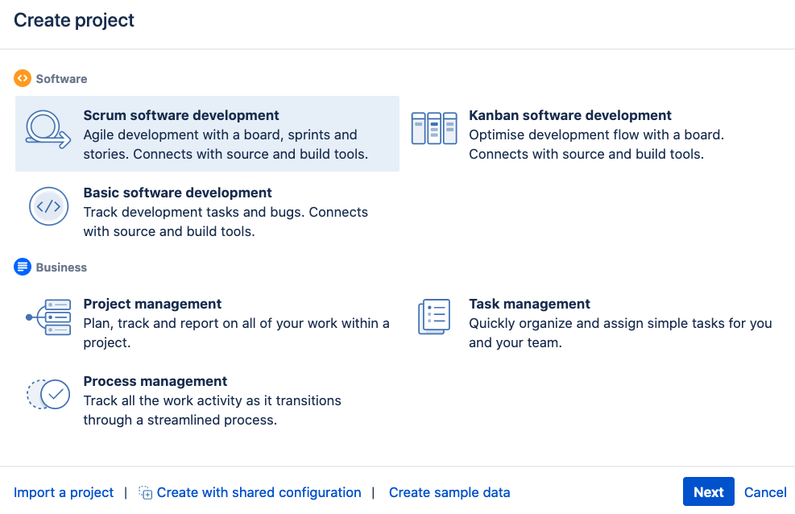
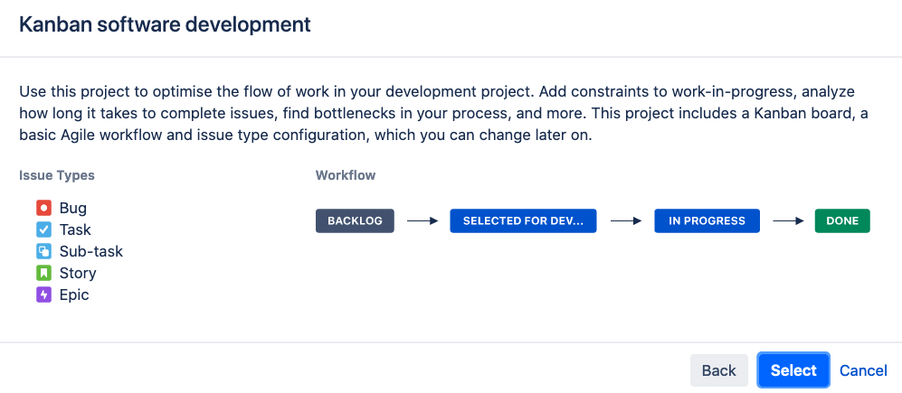
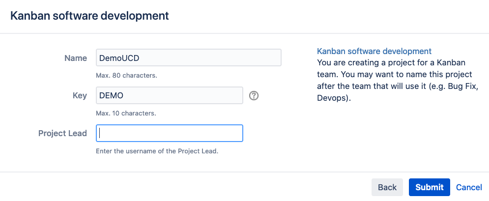

# Jira Setup

## Get Jira up and running

### Using Image from Dockerhub

* <https://hub.docker.com/r/atlassian/jira-software>

### Commands to run Jira

First we need to create a Volume to store Jira artifacts:

~~~sh
docker volume create --name jiraVolume
~~~

Then we can start it with the following command:

~~~sh
docker run -v jiraVolume:/var/atlassian/application-data/jira --name="jira" --memory="1024m" -d -p 8080:8080 atlassian/jira-software
~~~

Due RAM challenges on my laptop u maxed the memory usage of Jira to 1GB recommended are 2GB.

Starting or stopping Jira can be done with the following commands:

~~~sh
docker start jira

or

docker stop jira
~~~

### Configuration

After initial setup (needed to create Atlassian account to get evaluation key for this product) i just created a simple Kanban project.

No change of default workflow or fields was needed so i used the out of the box simple project type.

Info about Kanban software development workflow:

Enter project name and select admin

Now you can start creating the tickets which you can use to commit changes in your git repository.
