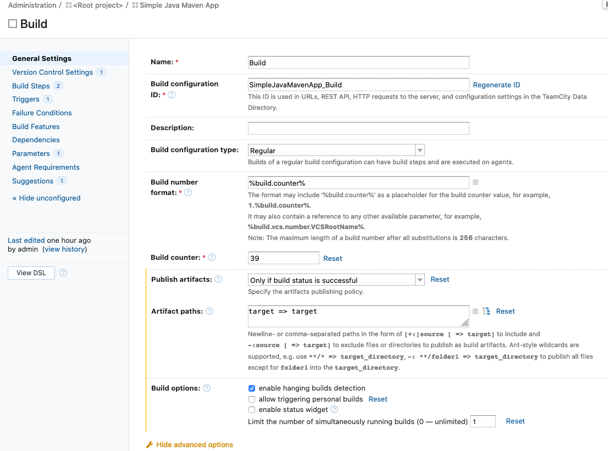
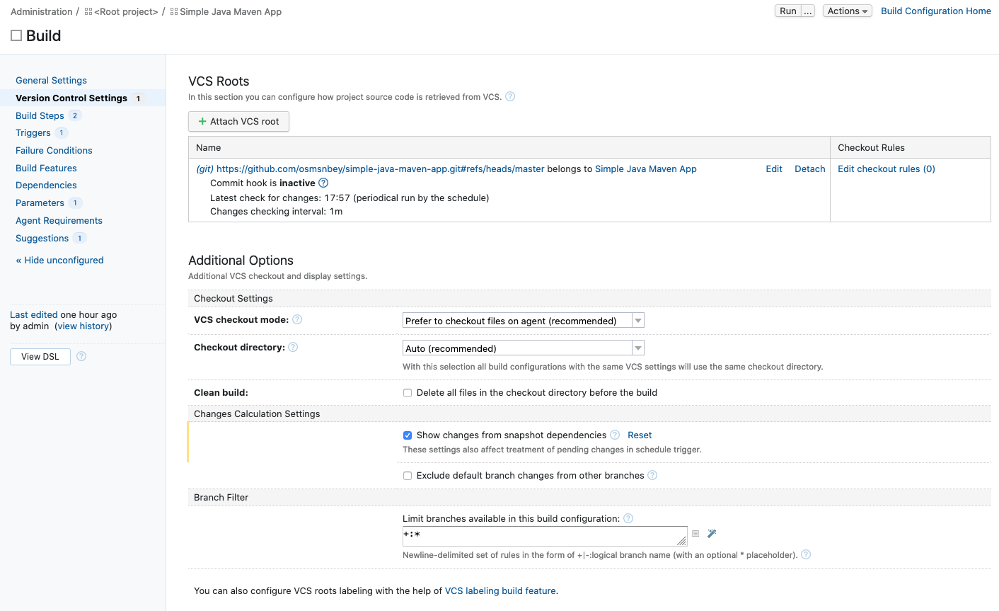
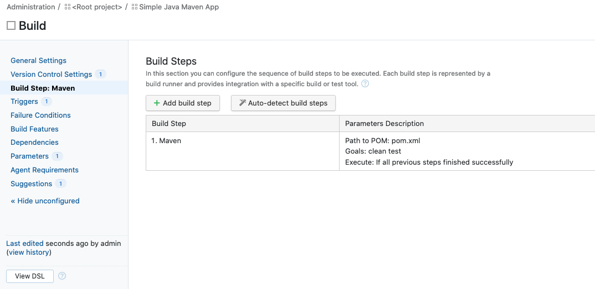
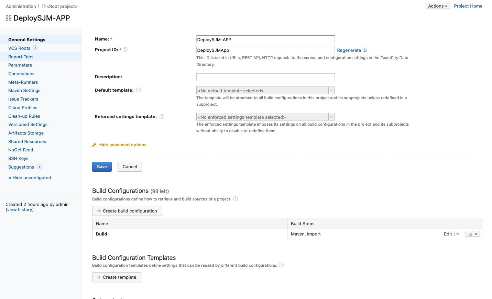
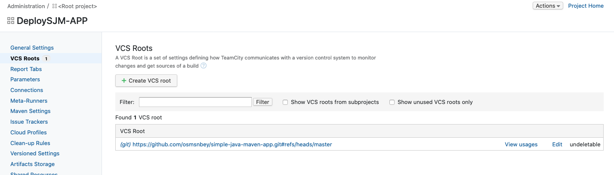
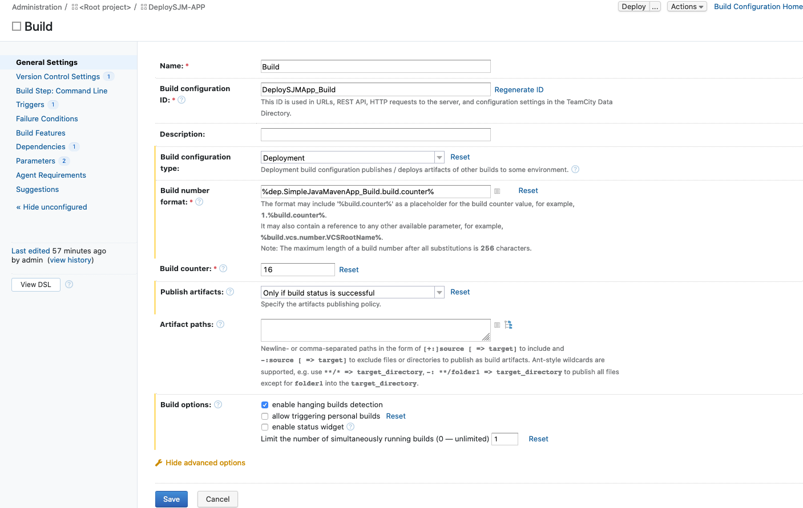
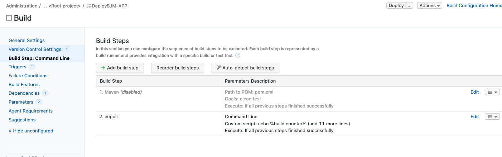

# TeamCity Setup

## Get TeamCity up and running

### Using Image from Dockerhub

* <https://hub.docker.com/r/jetbrains/teamcity-server>
  * <https://hub.docker.com/r/jetbrains/teamcity-minimal-agent/>
  * <https://hub.docker.com/r/jetbrains/teamcity-agent/>

### Commands to run

First we need to create Volumes to store TeamCity Server artifacts:

~~~sh
  docker volume create --name tcDataVolume
  docker volume create --name tcLogVolume
~~~

Also for the Agent:

~~~sh
  docker volume create --name tcAgentConf
~~~

Then we could start TC server with the following command:

~~~sh
  docker run -it --name teamcity-server-instance  \
    -v tcDataVolume:/data/teamcity_server/datadir \
    -v tcLogVolume:/opt/teamcity/logs  \
    -p <port-on-host>:8111 \
    jetbrains/teamcity-server
~~~

and the Agent:

~~~sh
  docker run -it -e SERVER_URL="localhost:8111"  \
    -v tcAgentConf:/data/teamcity_agent/conf  \
    jetbrains/teamcity-agent
~~~

But as we need also the TeamCity-Agent we will use a Docker-Compose file (see below)

### How to use [docker-compose.yml](tc/docker-compose.yml)

I have found this article which helped me to create my docker-compose file:

* <https://nad.dev/posts/2020/01/06/teamcity-server-agent-docker.html>

Here the docker-compose.yml in detail:

~~~yaml
version: "3"
services:
  tcs:
    image: jetbrains/teamcity-server
    container_name: teamcity-server
    ports:
      - "8111:8111"
    volumes:
      - tcDV:/data/teamcity_server/datadir
      - tcLV:/opt/teamcity/logs
  tca:
    image: jetbrains/teamcity-agent
    depends_on:
      - tcs
    container_name: teamcity-agent
    environment:
      SERVER_URL: "http://tcs:8111/"
    volumes:
      - tcAC:/data/teamcity_agent/conf

volumes:
  tcDV:
    external:
     name: tcDataVolume
  tcLV:
    external:
      name: tcLogVolume
  tcAC:
    external:
      name: tcAgentConf
~~~

## Project Setup

As soon as the containers are up and running, login and create the sample project

### Sample Project settings

* Name: Simple Java Maven App
* Project ID: SimpleJavaMavenApp (will be generated automatically)
* Git/VCS URL: <https://github.com/osmsnbey/simple-java-maven-app.git>
  * this contains also a MAVEN build config will be used!

Configuration Information:

General Settings:

---
Version Control System Settings:

---
Build Step:

### Dependent Project to Trigger Urbancode Component Version Import

Configuration Information

General Settings:

---

Version Control settings:

---

Build Settings:

I have referenced the build number from the build project so that they are in sync.

---
Build Steps:

#### Details of the Import Step

~~~sh
COMMITTEXT=`git show-branch --no-name HEAD`

curl -u PasswordIsAuthToken:62ac1c42-5948-4297-ae61-4fbce60d5fcd -k -d '{  "component": "TC-COMP" }' -H "Content-Type: application/json" -X PUT https://192.168.62.190:8443/cli/component/integrate

sleep 20s

curl -u PasswordIsAuthToken:62ac1c42-5948-4297-ae61-4fbce60d5fcd -k -d '{  "component": "TC-COMP", "name": "TicketID", "value": "'"$COMMITTEXT"'", "version": "%build.number%" }' -H "Content-Type: application/json" -X PUT https://192.168.62.190:8443/cli/version/versionProperties
~~~

* The first command get's the commit message where the Jira Ticket ID is stored
* Then trigger the component version import. I am using here the Token provided by UCD for the import user.
* Need to wait a few seconds till UCD has finished importing -> wait 20 seconds
* Next set the component version property "TicketID" with the Jira Ticket IDs
