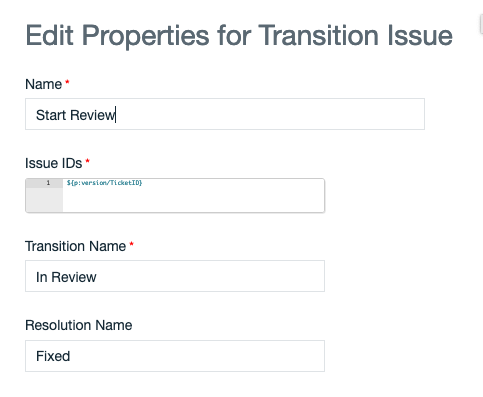
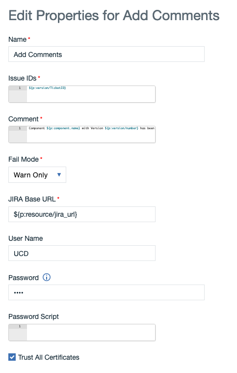

# UrbanCode Setup

## Plugins

### Jira Plugin

UrbanCode Deploy provides a Plugin to access Jira. You will find the complete documentation how to use it here:

* <https://www.urbancode.com/plugin/jira/>

Download it and install it as automation plugin.

### TeamCity Plugin

The Teamcity plugin is installed with UrbanCode, but if you need more details or a newer version:

* <https://www.urbancode.com/plugin/teamcity/>

## Component

Create new Component:

---

* Name: TC-COMP
* Source Configuration Type: TeamCity
* Repository URL: <http://192.168.62.1:8111>
* User: admin
* Password: admin
* Build configuration ID: SimpleJavaMavenApp_Build
* Copy to CodeStation: Y
* REST default
* Version Property Definition:
  * Create TicketID as Version property:
    * 
  * List of Version properties
    * 
  * How to access the TicketID:
    * ${p:version/TicketID}

---

* Create property at Resource Level for JIRA URL
  * 
  * using it with:
    * ${p:resource/jira_url}

---

### Deploy Process of Component

Deployment Process of Component:

---

This will set the Issue/Task into "In Progress" mode
Start Task Details:

* Name: Start Task
* Issue IDs: ${p:version/TicketID}
* Transition Name: In Progress
* Additional Comments: Starting Deployment of ${p:component.name} with Version ${p:version/TicketID}
* JIRA Base URL: ${p:resource/jira_url}
* User Name: UCD (or any other user who has access to the Jira Project)
* Password: **** (the Jira users password)

---

After successful deployment the Issue/Task/Ticket will be set to "In Review"
Start Review Details:

* Name: Start Review
* Issue IDs: ${p:version/TicketID}
* Transition Name: In Review
* JIRA Base URL: ${p:resource/jira_url}
* User Name: UCD (or any other user who has access to the Jira Project)
* Password: **** (the Jira users password)

---

Add additional Comment to the Issue/Task/Ticket that the component with given version has been deployed.
Add Comment Details:

* Name: Add Comments
* Issue IDs: ${p:version/TicketID}
* Comment: Component ${p:component.name} with Version ${p:version/number} has been deployed
* JIRA Base URL: ${p:resource/jira_url}
* User Name: UCD (or any other user who has access to the Jira Project)
* Password: **** (the Jira users password)

## Creation of Token to use with external Version Import

For security context create a new Token for the UC Version Importer

I have used the build in user "UC Version Import". Set the values accordingly to your environment security requirements.

Click Save and do not forget to copy the token!

